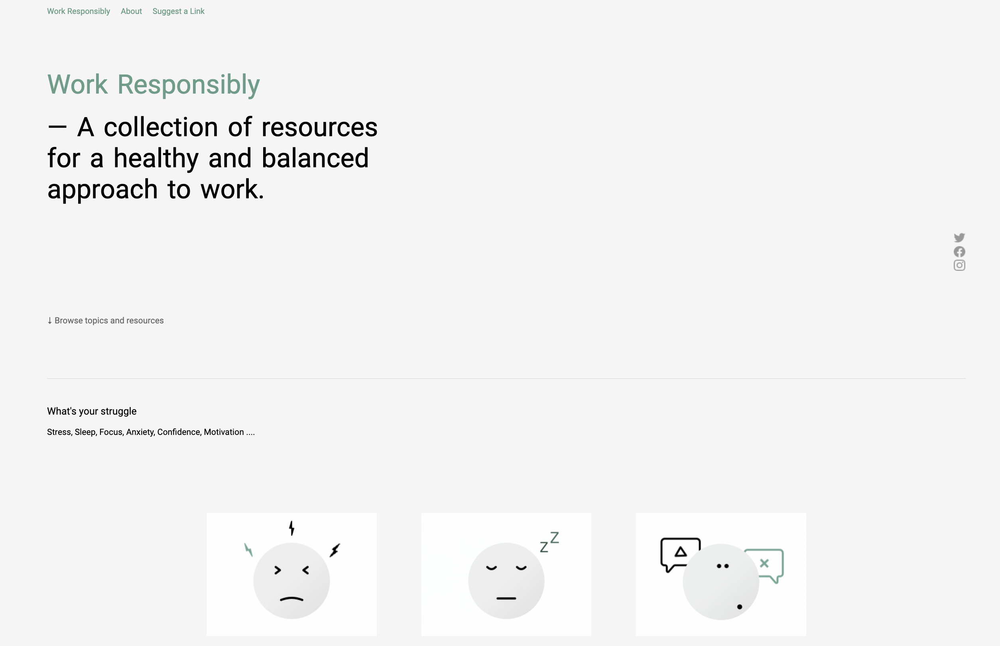

# Project Work-responsibly
> Outline a brief description of your project.
> Live demo [_here_](https://www.example.com). <!-- If you have the project hosted somewhere, include the link here. -->

## Table of Contents
* [General Info](#general-information)
* [Technologies Used](#technologies-used)
* [Features](#features)
* [Screenshots](#screenshots)
* [Project Status](#project-status)

<!-- * [License](#license) -->

## General Information
- Designvorlage aus Figma nachgebaut.
<!-- You don't have to answer all the questions - just the ones relevant to your project. -->

## Technologies Used
- HTML
- CSS

## Features
- Navbar
- Social-Links
- Pictures

## Screenshots

<!-- If you have screenshots you'd like to share, include them here. -->

## Project Status
Project is: _complete_

<!-- Optional -->
<!-- ## License -->
<!-- This project is open source and available under the [... License](). -->

<!-- You don't have to include all sections - just the one's relevant to your project -->